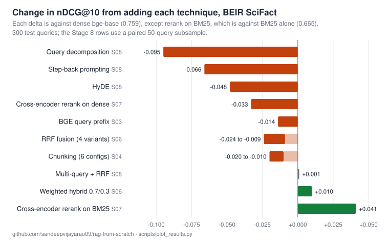

# RAG From Scratch

I implemented ten recommended RAG techniques and measured each one against the
same benchmark. Seven made retrieval worse, one changed nothing, and only two
helped.

This repo is the code, the numbers, and the reasoning for why. It is a
fifteen-stage ladder from naive RAG to production concerns; stages 1 to 12 are
built and measured, 13 and 14 have code but no measurements yet, and 15 is
planned.

[](LICENSE)
[](LICENSE)



## The results

Corpus is BEIR SciFact: 5,183 scientific abstracts, 300 labelled queries. Metric
is nDCG@10. Baseline is `bge-base-en-v1.5` at 0.759, which I validated against a
published figure of roughly 0.741 before building anything on top of it.

| Technique | Δ nDCG@10 |
|---|---|
| Chunking (6 configs, every one) | −0.010 to −0.020 |
| RRF fusion (4 variants, every one) | −0.009 to −0.024 |
| Cross-encoder reranking on dense | −0.033 |
| HyDE | −0.048 |
| Step-back prompting | −0.066 |
| Query decomposition | −0.095 |
| BGE query instruction prefix (Stage 3) | −0.014 |
| Multi-query (3 paraphrases + RRF) | +0.001 |
| Weighted hybrid 0.7/0.3 | +0.010 |
| Cross-encoder reranking on BM25 (vs BM25 alone) | +0.041 |

Two more techniques came later, measured on document subsets (every gold
document plus distractors) because each is expensive. Both arms of each
comparison use the same subset, so the deltas are fair but the absolute scores
are higher than the full-corpus table above.

| Technique | Subset | Δ nDCG@10 | Cost |
|---|---|---|---|
| Contextual retrieval (Stage 9) | 600 docs | −0.006 vs no chunking | one LLM call per chunk |
| Late interaction, MaxSim (Stage 10) | 800 docs | +0.011 | 241x the index, ~28x query latency |

Stage 12 tested self-correction. Routing queries that need no retrieval worked
(16 of 16 test prompts), but CRAG-style document grading flagged 87.5% of
retrievals as bad whether or not they had actually failed: balanced accuracy
0.50, which is chance. Details in
[`concepts/12_self_correction/`](concepts/12_self_correction/).

The two that worked are the two where I measured the gap before applying the
technique. For hybrid I checked how many queries BM25 found that dense missed
(nine, out of 300) before writing any fusion code. For reranking I only got a
gain after working out that the first stage has to be weaker than the reranker.

I want to be careful about what this does and does not show. It is not evidence
that these techniques are bad. It is evidence that they are conditional, and
that the condition is usually whether your current pipeline is already good at
the thing the technique fixes. `bge-base` on SciFact is a strong, well-matched
baseline. Reranking already flipped sign once in this repo, from −0.033 on dense
to +0.041 on BM25, so the same technique can be worth having or worth skipping
depending on what it sits behind.

### The generation half is a separate problem

Stage 11 measures what the model does with the documents, and it does not
behave the way the guides warn about.

```
context         gave verdict   NOT_ENOUGH
gold                      12           18    0.40  (want a verdict)
distractor                 5           25    0.83  (want NOT_ENOUGH)
empty                      0           30    1.00  (want NOT_ENOUGH)
```

Handed the correct document, `gemma4:e4b` declines to commit 60% of the time.
Handed irrelevant documents it correctly refuses 83% of the time. It is too
conservative, not reckless, which is the opposite of the failure everyone
writes about.

Reframing the task and relaxing the prompt each bought 0.07 and then stopped,
so the generator is the ceiling for this stage rather than the retrieval or the
wording. A system with perfect retrieval and this model would still fail on more
than half of SciFact. That is the argument for Method Rule 2: had I only
measured end-to-end accuracy I would have gone off tuning retrieval, which was
never the problem.

## Setup

Install [Ollama](https://ollama.com), then pull the two models the code uses.
The embedding model is the GGUF build of `bge-base-en-v1.5` on Hugging Face;
`ollama pull bge-base-en-v1.5` will not find it.

```bash
ollama pull hf.co/CompendiumLabs/bge-base-en-v1.5-gguf   # embeddings (68 MB)
ollama pull gemma4:e4b                                   # generation (9.6 GB)

pip install -r requirements.txt     # or requirements-core.txt to skip torch
./scripts/download_data.sh          # BEIR SciFact, ~8 MB
python concepts/01_naive_rag/naive_rag.py
```

`requirements-core.txt` (numpy, ollama, pydantic) covers every stage except 7
and 10, which need torch and pull cross-encoder weights from Hugging Face on
first run. Stage 9 also uses `hf.co/bartowski/Llama-3.2-1B-Instruct-GGUF` for
the per-chunk blurbs.

To check the headline baselines with one command (stages 3, 5 and 6, a few
minutes cold):

```bash
./scripts/reproduce.sh              # writes results/logs/*.txt
```

Unit tests for the pure-Python core (metrics, BM25, fusion, chunking) need no
Ollama or data:

```bash
pip install -r requirements-dev.txt && pytest
```

Everything runs locally. Embeddings, LLM outputs and cross-encoder scores are
cached to disk, so re-running a stage costs nothing and only new work is
computed.

## Where to start

Two entry points, depending on why you are here.

**Learning RAG?** [**LEARN.md**](LEARN.md) is a guided path from "what is an
embedding" to late interaction and self-correction. Eight parts, each with
something to run and a result to check against. It explains the mechanisms
rather than just reporting the numbers.

**Already know the techniques and deciding which to use?**
[**FLOW.md**](FLOW.md) is a build order with a diagnostic gate before each step,
so you can work out what applies to your corpus instead of trying all of it.

## Layout

```
LEARN.md      guided path, basic to advanced. Start here if learning.
FLOW.md       0-to-1 decision procedure. Start here if building.
concepts/     15 stages, beginner to pro. Code plus a README per stage.
rag/          shared library: retrieval, metrics, chunking, fusion, graph
results/      measured outputs and reproduce logs, version controlled
tests/        unit tests for rag/ (no Ollama needed)
NOTES.md      lab notebook: what broke, what I got wrong
SYSTEMS.md    taxonomy of RAG systems by the problem each solves
DECISIONS.md  design decisions with alternatives rejected
```

Start at [`concepts/`](concepts/) for the ladder, or read
[`concepts/07_reranking/`](concepts/07_reranking/) if you want the most
interesting single stage.

## No frameworks

No LangChain, no LlamaIndex, no vector database. BM25, cosine search, RRF,
MaxSim, label propagation and all the metrics are written directly. Partly
because I wanted to understand the mechanisms rather than configure them, and
partly because a framework would have hidden most of the findings above. The
`bge` query prefix and the RRF `k` parameter are both defaults you would never
question if a library set them for you.

Exact numpy brute-force search handles this corpus in well under a millisecond
and scales to a few hundred thousand vectors in tens of milliseconds. A vector
database would have added an approximate index and a recall loss to measure, for
a corpus that fits in 16MB of RAM.

## Method

Seven rules, arrived at mostly by violating them first.

1. No claimed improvement without a number.
2. Measure retrieval and generation separately. They fail differently and get
   fixed differently.
3. Distrust any single metric, especially on synthetic data. Report the gap
   between an easy variant and a hard one.
4. Ablate conventions rather than inheriting them.
5. Run the cheap diagnostic that predicts the result before running the
   expensive experiment.
6. State the noise floor. A delta smaller than sampling error is not a finding.
7. A confirmed negative result is a result.

Rule 3 came out of Stage 2, where LLM-generated eval questions inherited rare
vocabulary from their source chunks and inflated recall@1 from 0.680 to 0.927.
Rule 5 came out of Stage 4, where a two-second check on token lengths predicted
seventeen minutes of chunking experiments.

## Limitations

Worth saying plainly, because most of the negative results above are weaker than
they look:

- **One corpus.** SciFact abstracts are short, single-topic, and written in the
  same register as the queries. That is close to the best case for a dense
  bi-encoder and close to the worst case for chunking and query rewriting. I
  expect several of these results to flip on long multi-topic documents. Not
  tested.
- **Small deltas, no significance testing.** At n=300 anything under about 0.02
  nDCG is inside the noise. The hybrid win (+0.010) and the prefix loss (−0.014)
  both fall there. A paired bootstrap over per-query scores is the right next
  step and I have not done it. The larger results (reranking, HyDE, decomposition)
  are outside that band.
- **Subsampled where noted.** Stage 8 runs on a fixed 50-query subsample because
  each technique costs an LLM call per query. The baseline is scored on the same
  50, so deltas are paired, but absolute values are not comparable to the
  full-300 tables.
- **Subsets for the expensive stages.** Stages 9 and 10 run on 600- and
  800-document subsets, and Stages 11 and 12 on 16 to 30 sampled queries, so
  their results are directional. The sample sizes are in each stage README.
- **Stages 13 to 15 are not measured.** Agentic multi-hop retrieval
  (`rag/adaptive.py`) and GraphRAG (`rag/graph.py`) have code but no eval
  runner yet; Stage 15 is a plan. Their READMEs state the expected result
  before the run so the predictions stay falsifiable.

## Attribution

Stage 1 is adapted from a public "RAG from scratch" tutorial (the cat-facts
corpus with Ollama and `bge-base`). Everything from Stage 2 onward is my own:
the eval harness, the BEIR integration, BM25, the fusion and reranking analysis,
and every measurement in this repo.

Built with AI assistance, which is recorded in the commit trailers.
